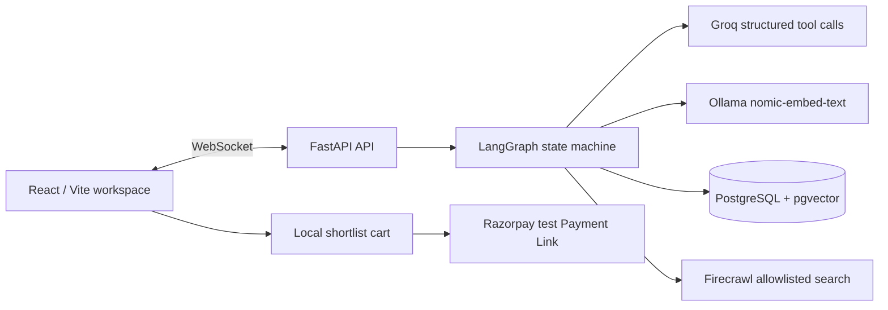

# Pricewise — Agentic Shopping Advisor

A production-minded, stateful shopping advisor for Indian e-commerce. Pricewise asks only the missing questions, searches approved retailers, compares cached price history against Indian sale windows, and produces a grounded **Buy now** or **Wait** recommendation.

<div align="center">


</div>

## Table of Contents

- [Project overview](#project-overview)
- [Architecture](#architecture)
- [Shopping workflow](#shopping-workflow)
- [Features](#features)
- [Supported retailers](#supported-retailers)
- [Repository structure](#repository-structure)
- [Configuration](#configuration)
- [Run locally](#run-locally)
- [API contract](#api-contract)
- [Razorpay test checkout](#razorpay-test-checkout)
- [Verification](#verification)
- [Scope and safety](#scope-and-safety)

## Project overview

Pricewise is not a generic chat wrapper. Its LangGraph workflow preserves intent across real browser turns, pauses for a human reply when information is incomplete, then uses a cache-first retailer search and deterministic price logic. The language model extracts and phrases facts; it does not invent a price recommendation.

## Architecture



## Shopping workflow

1. A shopper types a request, such as “I need a laptop”.
2. Groq extracts only stated details and identifies required missing fields.
3. The graph pauses over WebSocket and asks a single clarification question.
4. Once complete—or after the four-turn cap—the graph checks the fresh PostgreSQL cache.
5. A cache miss calls Firecrawl only for approved Indian retail domains, then saves products and a price-history point.
6. Matching products are filtered, deduplicated, ranked, and limited to five.
7. The app checks stored historical prices and the static Indian sale calendar.
8. Deterministic logic chooses `buy_now`, `wait`, or `insufficient_data`; Groq then phrases the evidence-backed result.

## Features

- Stateful LangGraph clarification loop with a four-turn guard.
- Structured Groq calls—no regular-expression parsing of model output.
- PostgreSQL product cache, historical price table, conversation snapshot, and pgvector similarity search.
- Firecrawl restricted in code to five approved retailer domains.
- Real-time WebSocket stages: search, compare, price analysis, calendar, and final recommendation.
- Dark demo workspace with remembered demo identity and a reset/switch-user control.
- Local browser shortlist cart that persists across refreshes.
- Optional Razorpay **test-mode** Payment Link created from the server’s cached product price.
- Explicit “insufficient data” handling rather than fabricated price trends.

## Supported retailers

Live Firecrawl search is restricted to:

- `amazon.in`
- `flipkart.com`
- `croma.com`
- `reliancedigital.in`
- `mdcomputers.in`

## Repository structure

```text
shopping_agent/
├── backend/
│   ├── graph/              # State contract, node implementations, LangGraph wiring
│   ├── routers/            # Health, WebSocket chat, session and payment-link APIs
│   ├── services/           # Database, Groq, Ollama, Firecrawl and Razorpay adapters
│   ├── tests/              # Unit and flow tests
│   ├── .env.example
│   └── main.py
├── database/
│   └── schema.sql          # PostgreSQL + pgvector schema
├── frontend/
│   └── src/                # React workspace, chat, progress, cards, cart and charts
├── docs/
│   └── RUNBOOK.md
└── README.md
```

## Configuration

Copy `backend/.env.example` to `backend/.env`, then set the required values. Never commit this file.

| Variable | Required | Purpose |
|---|---:|---|
| `GROQ_API_KEY` | Yes | Structured intent and response wording. |
| `GROQ_MODEL` | Yes | Defaults to `openai/gpt-oss-120b`, available on the configured account. |
| `FIRECRAWL_API_KEY` | Yes for cache misses | Allowlisted live retailer search and extraction. |
| `DATABASE_URL` | Yes | PostgreSQL database with the pgvector schema applied. |
| `OLLAMA_BASE_URL` | Yes | Local Ollama server; default `http://localhost:11434`. |
| `RAZORPAY_KEY_ID` | Optional | Razorpay **test-mode** key ID for Payment Links. |
| `RAZORPAY_KEY_SECRET` | Optional | Razorpay **test-mode** secret; server-only. |
| `ALLOWED_ORIGINS` | Yes | Browser origins permitted by FastAPI CORS. |

## Run locally

Prerequisites: Python 3.11+, Node 20+, PostgreSQL with pgvector, Ollama with `nomic-embed-text`, a Groq key, and a Firecrawl key.

```powershell
# one-time Python dependencies
cd C:\Users\Garv Gupta\Desktop\shopping_agent
python -m venv .venv
.\.venv\Scripts\python.exe -m pip install -r backend\requirements.txt

# start the backend
.\.venv\Scripts\python.exe -m uvicorn backend.main:app --host 127.0.0.1 --port 8000
```

In a second terminal:

```powershell
cd C:\Users\Garv Gupta\Desktop\shopping_agent\frontend
npm install
npm run dev
```

Open `http://127.0.0.1:5173`. The demo-name screen appears on a fresh browser profile. If a previous name was remembered, select **Switch demo user** in the header.

## API contract

| Method | Endpoint | Purpose |
|---|---|---|
| `GET` | `/health` | Basic API health check. |
| `WS` | `/ws/chat` | Conversation, graph stage events, clarification pauses, and final results. |
| `GET` | `/session/{session_id}/history` | Restores a persisted graph state. |
| `POST` | `/payment-link` | Creates a server-side Razorpay test Payment Link for one cached product. |

## Razorpay test checkout

After live product results are returned, select **Add to shortlist** on a product, then use **Razorpay test checkout** in the cart. Pricewise sends only the product ID to its backend; the backend re-reads the current cached INR price and creates a unique Razorpay Payment Link. The secret never reaches the browser.

This is a demo payment hook, not retailer checkout automation. Payment occurs on Razorpay’s hosted page. Razorpay documents Payment Links as `POST /v1/payment_links`, with the amount in the smallest currency unit and a unique reference ID. [Razorpay’s official API guide](https://razorpay.com/docs/api/payments/payment-links/create-standard/) also notes a 30-link test-mode limit.

## Verification

```powershell
cd C:\Users\Garv Gupta\Desktop\shopping_agent
.\.venv\Scripts\python.exe -m pytest backend\tests -q
.\.venv\Scripts\python.exe -m backend.graph.test_run
cd frontend
npm run build
```

## Scope and safety

Pricewise does not log into retailer accounts, place items in retailer carts, automate browser checkout, or scrape outside its fixed allowlist. The in-app cart is a private shortlist. Razorpay integration is deliberately test-mode only until a separate production payments, signature-verification, webhook, and compliance review is completed.

## Build progress

- [x] Project foundation and repository setup
- [x] Database schema and data-access layer
- [x] Backend graph services and nodes
- [x] FastAPI WebSocket API
- [x] React comparison dashboard
- [x] Offline end-to-end verification and local run guide

## Local setup

1. Install PostgreSQL with the `pgvector` extension, then run `database/schema.sql`.
2. Install Ollama and run `ollama pull nomic-embed-text`.
3. Copy `backend/.env.example` to `backend/.env` and add your Groq, Firecrawl, and database credentials.
4. Create a Python virtual environment, install `backend/requirements.txt`, and run the FastAPI server.
5. Install the frontend dependencies and run the Vite development server.

For the exact Windows commands and verification checks, see [docs/RUNBOOK.md](docs/RUNBOOK.md).

The backend is designed to be testable before secrets and external services are configured. It returns useful, explicit configuration errors rather than inventing retail data.

For Groq, the default configured model is `openai/gpt-oss-120b`; it is selected because the older Llama model ID is no longer available to the connected account.

## Retailers

Only these retailers are eligible for live results:

- amazon.in
- flipkart.com
- croma.com
- reliancedigital.in
- mdcomputers.in
